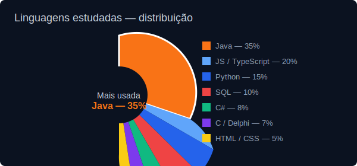
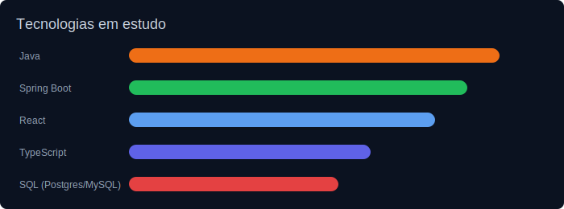

# Gabriel Sales David — Desenvolvedor Full Stack Jr.

### Entrego APIs Java escaláveis e front-ends React que funcionam em produção

Sou desenvolvedor Full Stack com foco em Backend Java (Spring Boot) e Frontend React. Construo APIs seguras e testáveis e interfaces que facilitam a experiência do usuário — sempre com atenção à entrega de valor rápido, qualidade de código e colaboração com times de produto.

	

---

**O que eu trago para seu time**

- Entrega de features end-to-end (API + UI) com foco em segurança e desempenho
- Boas práticas: arquitetura em camadas, DTOs, testes e tratamento de erros centralizado
- Integração com serviços externos (APIs, SMS, gateways) e pipelines de CI/CD

---

### Principais competências

| Camada | Tecnologias |
| :--- | :--- |
| **Backend** | Java 17+, Spring Boot (Security, JPA, OAuth2/JWT), Maven |
| **Frontend** | React, TypeScript, HTML5, CSS3, Tailwind, Axios |
| **Banco de Dados** | PostgreSQL, MySQL, H2 (testes) |
| **DevOps & Tools** | Docker, Git, CI/CD, Postman, Railway/Heroku |

---

### Projetos selecionados

- 🛒 DSCommerce — E-commerce com autenticação, controle de perfis e segurança baseada em OAuth2/JWT. (Java, Spring, React)
- 📈 DSMeta — Dashboard de métricas com integração externa e envio de notificações (Twilio). (React, Spring)
- 📂 DSCatalog — Catálogo de produtos com filtros avançados e paginação; arquitetura em camadas e boas práticas de DTOs.

Links: https://github.com/gabrielsalesdavid

---

### Como posso agregar valor

- Acelerar entregas mantendo qualidade e testabilidade
- Fortalecer segurança e autenticação em APIs
- Construir integrações confiáveis com terceiros

---

---

### 📚 Repositórios de estudo (cursos / exercícios)

> Esta seção é atualizada automaticamente com seus repositórios públicos.

<!-- repos-start -->
- [Alura-Cypress-Automatizando-Testes-E2E](https://github.com/gabrielsalesdavid/Alura-Cypress-Automatizando-Testes-E2E)
- [Alura-Itensivo-Python](https://github.com/gabrielsalesdavid/Alura-Itensivo-Python)
- [Delphi-Agenda](https://github.com/gabrielsalesdavid/Delphi-Agenda)
- [Delphi-Sistema-Clinica](https://github.com/gabrielsalesdavid/Delphi-Sistema-Clinica)
- [Descomplica](https://github.com/gabrielsalesdavid/Descomplica)
- [DevSuperior-Banco-de-Dados-SQL](https://github.com/gabrielsalesdavid/DevSuperior-Banco-de-Dados-SQL)
- [DevSuperior-C-Sharp](https://github.com/gabrielsalesdavid/DevSuperior-C-Sharp)
- [DevSuperior-Consultas-em-SQL](https://github.com/gabrielsalesdavid/DevSuperior-Consultas-em-SQL)
- [DevSuperior-Desafio-Git-Merge](https://github.com/gabrielsalesdavid/DevSuperior-Desafio-Git-Merge)
- [DevSuperior-Desafio-Git-Reset](https://github.com/gabrielsalesdavid/DevSuperior-Desafio-Git-Reset)
- [DevSuperior-Estrutura-De-Dados](https://github.com/gabrielsalesdavid/DevSuperior-Estrutura-De-Dados)
- [DevSuperior-GitHub](https://github.com/gabrielsalesdavid/DevSuperior-GitHub)
- [DevSuperior-Intesivao-Java-Spring](https://github.com/gabrielsalesdavid/DevSuperior-Intesivao-Java-Spring)
- [DevSuperior-Java](https://github.com/gabrielsalesdavid/DevSuperior-Java)
- [DevSuperior-Linguagem-C](https://github.com/gabrielsalesdavid/DevSuperior-Linguagem-C)
- [DevSuperior-Linguagem-C-PP](https://github.com/gabrielsalesdavid/DevSuperior-Linguagem-C-PP)
- [DevSuperior-Linguagem-em-C-Sharp](https://github.com/gabrielsalesdavid/DevSuperior-Linguagem-em-C-Sharp)
- [DevSuperior-Linguagem-Java](https://github.com/gabrielsalesdavid/DevSuperior-Linguagem-Java)
- [DevSuperior-Linguagem-Python](https://github.com/gabrielsalesdavid/DevSuperior-Linguagem-Python)
- [DevSuperior-Logica-de-Programacao-e-Algoritmo](https://github.com/gabrielsalesdavid/DevSuperior-Logica-de-Programacao-e-Algoritmo)
- [DevSuperior-Nivelamento-HTML-CSS](https://github.com/gabrielsalesdavid/DevSuperior-Nivelamento-HTML-CSS)
- [DevSuperior-Nivelamento-JavaScript](https://github.com/gabrielsalesdavid/DevSuperior-Nivelamento-JavaScript)
- [DevSuperiorSQL-DDL-DML](https://github.com/gabrielsalesdavid/DevSuperiorSQL-DDL-DML)
- [DioMe-Avanade-Spring-Boot](https://github.com/gabrielsalesdavid/DioMe-Avanade-Spring-Boot)
- [DioMe-Bradesco](https://github.com/gabrielsalesdavid/DioMe-Bradesco)
- [DioMe-Bradesco-Desafio](https://github.com/gabrielsalesdavid/DioMe-Bradesco-Desafio)
- [DioMe-Conta-Banco-Project](https://github.com/gabrielsalesdavid/DioMe-Conta-Banco-Project)
- [DioMe-Fundamentos-Java](https://github.com/gabrielsalesdavid/DioMe-Fundamentos-Java)
- [DioMe-Jogo-Sudoku](https://github.com/gabrielsalesdavid/DioMe-Jogo-Sudoku)
- [DioME-UML](https://github.com/gabrielsalesdavid/DioME-UML)
- [PROJECT-GRADLE-BOARD](https://github.com/gabrielsalesdavid/PROJECT-GRADLE-BOARD)
- [Project-Gradle-Java-Lombok-With-Kotlin](https://github.com/gabrielsalesdavid/Project-Gradle-Java-Lombok-With-Kotlin)
- [Project-Gradle-Java-With-Lombok](https://github.com/gabrielsalesdavid/Project-Gradle-Java-With-Lombok)
- [PROJECT-MAVEN-JAVA-WITH-LOMBOK](https://github.com/gabrielsalesdavid/PROJECT-MAVEN-JAVA-WITH-LOMBOK)
- [RocketSeat-NLW-Expert](https://github.com/gabrielsalesdavid/RocketSeat-NLW-Expert)
- [RocketSeat-NLW-Journey](https://github.com/gabrielsalesdavid/RocketSeat-NLW-Journey)
- [RocketSeat-NLW-Unite](https://github.com/gabrielsalesdavid/RocketSeat-NLW-Unite)
- [Testes-Linkedin](https://github.com/gabrielsalesdavid/Testes-Linkedin) — Faço testes de QUIZ que aparece na minha timeline do linkedin.
- [Udemy-Nelio-Alves-Java-Completo-2023-Poo-Proje](https://github.com/gabrielsalesdavid/Udemy-Nelio-Alves-Java-Completo-2023-Poo-Proje)
<!-- repos-end -->

---

### 📊 Tecnologias estudadas

Abaixo um resumo visual das tecnologias que venho estudando e aplicando em projetos.

---

### 📫 Contato

- LinkedIn: https://linkedin.com/in/gabriel-s-java-python-csharp-sql
- Email: gabrielsalesdavid@hotmail.com

---

> Aberto a oportunidades: entrevistas técnicas, vagas CLT ou contratos remotos.
